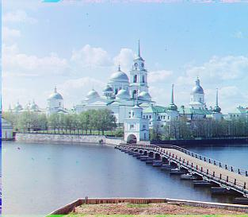

# Project 1

Images of the Russian Empire: Colorizing the [Prokudin-Gorskii photo collection](https://www.loc.gov/collections/prokudin-gorskii/)

## Introduction

In construction!

## Single Scale Alignment

Explanation in construction!

- Search space: [-15, 15]
- Image similarity metric used: SSD (sum squared difference) of the 2 image matrices
- Cropped all image channels so that only the inner 80% of the image remains (e.g. 10% is cropped off each end of the height and width)

Below are the results for the 3 small .jpg images (cathedral, monastery, tobolsk):

## Multi-Scale Alignment (Image Pyramid)

In construction!

## Bells and Whistles (Extra Credit)

In construction!
