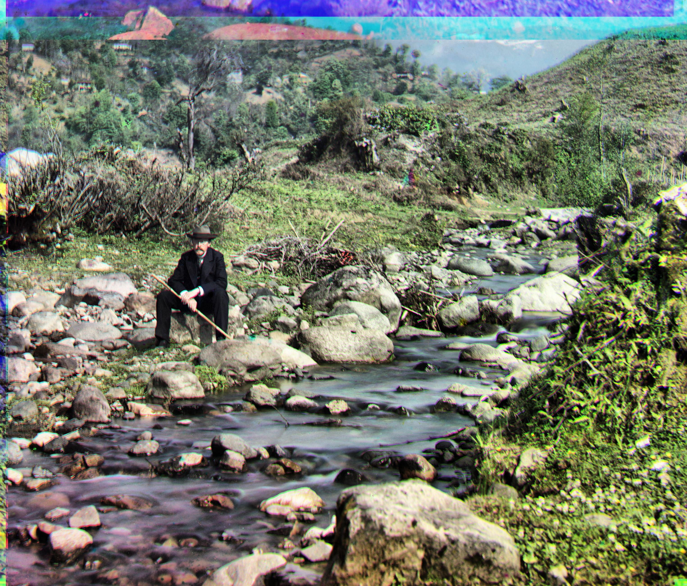

# Project 1

Images of the Russian Empire: Colorizing the [Prokudin-Gorskii photo collection](https://www.loc.gov/collections/prokudin-gorskii/)

[Project Spec](https://inst.eecs.berkeley.edu/~cs180/fa24/hw/proj1/)

1. Table of Contents
{:toc}

## Introduction

The Prokudin-Gorskii photo collection is a collection of photos taken by [Sergey Prokudin-Gorskii](https://en.wikipedia.org/wiki/Sergey_Prokudin-Gorsky) before there was color photography. He took identical photos using red, green, and blue filters and imagined that in the future, there would be a method to combine all 3 channels into a single, color photo. Below is an example of the `cathedral.jpg` red, green, and blue frames:

    

In this project, I was tasked with combining each RGB channel into a color photo using computational methods (primarily using  the `numpy` and `skimage` libraries). The main challenge in combining the images is aligning them on top of each other.

The Library of Congress also performed the same task, you can see their results [here](https://www.loc.gov/exhibits/empire/making.html).

## Single Scale Alignment

For images with small dimensions, it is sufficient to align each channel by trying every possible translation within a search space of [-15, 15] pixels. For each translation, we calculate the similarity between the translated image (the image we want to align) and the base image (the image we want to align *to*) using some metric.

I experimented with 4 metrics:

1. Sum squared difference (SSD)
2. Euclidean distance
3. Normalized cross-correlation (NCC)
4. [Structural similarity](https://scikit-image.org/docs/stable/api/skimage.metrics.html#skimage.metrics.structural_similarity)

Because they all had similar results for single scale alignment, I arbitrarily chose SSD as my metric for both single scale and multi-scale alignment.

Before aligning the images, I also cropped all image channels so that only the inner 80% of the image remains (e.g. 10% is cropped off each end of the height and width).

Below are the results for the 3 small `.jpg` images (`cathedral`, `monastery`, and `tobolsk`):

|  |  |  |

Here were the calculated displacements (I aligned all 3 images to the blue (B) channel):

| Image Name | G Displacement | R Displacement |
| :--- | :--- | :--- |
| cathedral.jpg | (2, 5) | (3, 12) |
| monastery.jpg | (2, -3) | (2, 3) |
| tobolsk.jpg | (3, 3) | (3, 6) |

## Multi-Scale Alignment (Image Pyramid)

For images with larger dimensions, it would take too long to do an exhaustive search on the original image. To solve this problem, I used an [image pyramid](https://en.wikipedia.org/wiki/Pyramid_(image_processing)). Specifically this was the algorithm I used:

1. Read in the RGB channels the same way as single scale alignment
2. Crop the channels the same way as single scale alignment
3. Align the R and G channels to the B channel using an image pyramid:
    1. Rescale the original images by a factor of 1/16
    2. Use single scale alignment on the rescaled images over a search space of [-15, 15] pixels to find the best displacement
    3. Rescale the rescaled image by a factor of 2
    4. Use single scale alignment on the rescaled image over a search space of [-2, 2] pixels (centered at the current best displacement) to find the best displacement
    5. Repeat steps 3.3 - 3.4 until the rescaled image reaches the same size as the original image
4. Use the final optimal displacement to translate the original image
5. `np.dstack` the aligned RGB channels to form the final colorized image the same way as single scale alignment

Below are the results for the large `.tif` images and their displacements. Notably, the `emir.tif` is not very well aligned compared to the others.

|  |  |  |
| church.tif   G: (0, 16), R: (-8, 52) | emir.tif   G: (22, 44), R: (-240, 96) | harvesters.tif   G: (16, 54), R: (14, 122) |
|  |  |  |
| icon.tif   G: (16, 38), R: (20, 86) | lady.tif   G: (8, 42), R: (8, 104) | melons.tif   G: (8, 82), R: (12, 180) |
|  |  |  |
| onion_church.tif   G: (26, 44), R: (36, 102) | sculpture.tif   G: (-10, 32), R: (-26, 140) | self_portrait.tif   G: (26, 74), R: (36, 176) |
|  |  | No more images! |
| three_generations.tif   G: (14, 52), R: (12, 114) | train.tif   G: (0, 44), R: (24, 92) | N/A |

## Bells and Whistles (Extra Credit)

### Automatic contrasting (Histogram equalization)

Used [Histogram Equalization](https://en.wikipedia.org/wiki/Histogram_equalization) to perform automatic contrasting. This equalizes the distribution of pixel colors in the image.

Specifically, I used:

- [`skimage.exposure.equalize_hist`](https://scikit-image.org/docs/stable/api/skimage.exposure.html#skimage.exposure.equalize_hist)
- [`skimage.exposure.equalize_adapthist`](https://scikit-image.org/docs/stable/api/skimage.exposure.html#skimage.exposure.equalize_adapthist)

As you can see from the results below, the regular histogram equalization usually yielded a "brighter contrast" while the adaptive histogram equalization yielded a "darker contrast".

| Before | After Histogram Equalization | After Contrast Limited Adaptive Histogram Equalization (CLAHE) |
| :--- | :--- | :--- |
|  |  |  |
|  |  |  |
|  |  |  |
|  |  |  |

### Automatic color balancing (aka white balancing)

The first color balancing method I used was **white patch**, where you assume that the brightest pixel (or the pixel in the Xth percentile of brightness) is white and rescale everything accordingly.

| Before | After |
| :--- | :--- |
|  |  |
|  |  |
|  |  |

The second color balancing method I used was **gray world**, where you rescale the pixel values under the assumption that the average pixel value is gray. This resulted in a blueish tinge to images.

| Before | After |
| :--- | :--- |
|  |  |
|  |  |
|  |  |

### Better Features

Noticeably, the `emir.tif` image did not get aligned properly using an image similarity metric of SSD. Switching the metric to maximizing **structural similarity** fixed the alignment. The best displacement was G: (24, 48), R: (46, 102).

| Before | After |
| :--- | :--- |
|  |  |

## References

- [Alec Li's Project 1](https://inst.eecs.berkeley.edu/~cs180/fa23/upload/files/proj1/alec.li/)
- [Jeffrey Tan's Project 1](https://inst.eecs.berkeley.edu/~cs180/fa23/upload/files/proj1/tanjeffreyz02/)
- [Bryan Li's Project 1](https://inst.eecs.berkeley.edu/~cs180/fa23/upload/files/proj1/bryanli0/)
- [Minseok Son's Project 1](https://inst.eecs.berkeley.edu/~cs180/fa23/upload/files/proj1/tom5079/)
- [Introduction to Image Processing with Python by Erika Lacson](https://python.plainenglish.io/introduction-to-image-processing-with-python-bb39c83366a4)
