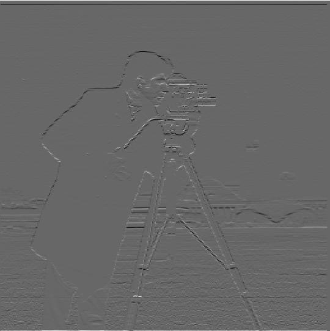

# Project 2

Fun with Filters and Frequencies

[Original project spec](https://inst.eecs.berkeley.edu/~cs180/fa24/hw/proj2/index.html)

## Part 1: Fun with filters

### Part 1.1

By convolving the original image with [finite difference](https://en.wikipedia.org/wiki/Finite_difference) operators,
I can obtain the gradient/magnitude image, which shows the edges of the image. To greater accentuate the edges,
I binarized the gradient/magnitude image (e.g. all pixels above a certain threshold are set to white and everything
else is black).

<table>
    <tr>
        <td>Original</td>
        <td>Partial Derivative (dx)</td>
        <td>Partial Derivative (dy)</td>
        <td>Gradient/Magnitude (Edges)</td>
        <td>Binarized</td>
    </tr>
    <tr>
        <td></td>
        <td></td>
        <td></td>
        <td></td>
        <td></td>
    </tr>
</table>

### Part 1.2: Derivative of Gaussian (DoG) Filter

To reduce noise on the edge detection, we can first blur the cameraman image using a [Gaussian filter](https://en.wikipedia.org/wiki/Gaussian_blur), and then convolve the blurred image with the finite difference operators.

<table>
    <tr>
        <td>Blurred</td>
        <td>Partial Derivative (dx)</td>
        <td>Partial Derivative (dy)</td>
        <td>Gradient/Magnitude (Edges)</td>
        <td>Binarized</td>
    </tr>
    <tr>
        <td></td>
        <td></td>
        <td></td>
        <td></td>
        <td></td>
    </tr>
</table>

We can also demonstrate the commutativity of convolving and applying the Gaussian filter. Below are the results of convolving the Gaussian with the finite difference operators, and then convolving the blurred finite difference operators with the original image.

<table>
    <tr>
        <td>DoG dx finite difference operator</td>
        <td>DoG dy finite difference operator</td>
        <td>DoG dx convolved with cameraman</td>
        <td>DoG dy convolved with cameraman</td>
        <td>DoG Magnitude</td>
        <td>DoG Binarized</td>
    </tr>
    <tr>
        <td></td>
        <td></td>
        <td></td>
        <td></td>
        <td></td>
        <td></td>
    </tr>
</table>

## Part 2

### Part 2.1

### Part 2.2

### Part 2.3

### Part 2.4
