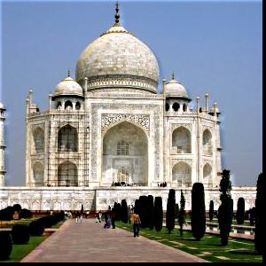
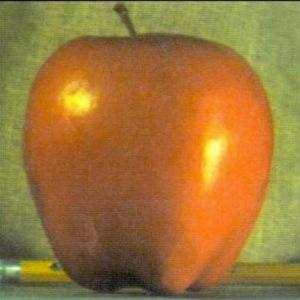
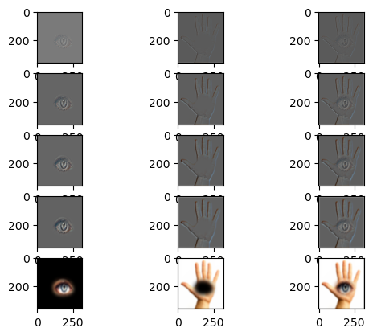

<!-- Mathjax Support -->

# Project 2

Fun with Filters and Frequencies

[Original project spec](https://inst.eecs.berkeley.edu/~cs180/fa24/hw/proj2/index.html)

1. Table of Contents
{:toc}

## Part 1: Fun with filters

### Part 1.1: Finite Difference Operator

By convolving the original image with [finite difference](https://en.wikipedia.org/wiki/Finite_difference) operators,
I can obtain the gradient/magnitude image, which shows the edges of the image. This image is calculated by taking the magnitude of the gradient, e.g. `np.sqrt(partial_x ** 2 + partial_y ** 2)`. To greater accentuate the edges,
I binarized the gradient/magnitude image (e.g. all pixels above a certain threshold are set to white and everything
else is black).

<table>
    <tr>
        <td>Original</td>
        <td>Partial Derivative (dx)</td>
        <td>Partial Derivative (dy)</td>
        <td>Gradient/Magnitude (Edges)</td>
        <td>Binarized</td>
    </tr>
    <tr>
        <td></td>
        <td></td>
        <td></td>
        <td></td>
        <td></td>
    </tr>
</table>

### Part 1.2: Derivative of Gaussian (DoG) Filter

We can first blur the cameraman image using a [Gaussian filter](https://en.wikipedia.org/wiki/Gaussian_blur), and then convolve the blurred image with the finite difference operators. Compared to Part 1.1, we can see there is less noise on the final binarized edge detection image.

<table>
    <tr>
        <td>Blurred</td>
        <td>Partial Derivative (dx)</td>
        <td>Partial Derivative (dy)</td>
        <td>Gradient/Magnitude (Edges)</td>
        <td>Binarized</td>
    </tr>
    <tr>
        <td></td>
        <td></td>
        <td></td>
        <td></td>
        <td></td>
    </tr>
</table>

We can also demonstrate the commutativity of convolving and applying the Gaussian filter. Below are the results of convolving the Gaussian with the finite difference operators, and then convolving the blurred finite difference operators with the original image.

<table>
    <tr>
        <td>DoG dx finite difference operator</td>
        <td>DoG dy finite difference operator</td>
        <td>DoG dx convolved with cameraman</td>
        <td>DoG dy convolved with cameraman</td>
        <td>DoG Magnitude</td>
        <td>DoG Binarized</td>
    </tr>
    <tr>
        <td></td>
        <td></td>
        <td></td>
        <td></td>
        <td></td>
        <td></td>
    </tr>
</table>

## Part 2: Fun with Frequencies

### Part 2.1: Image "Sharpening"

To "sharpen" an image, you can take the original image and subtract the Gaussian blurred image to get the high frequencies of the image. Then, you can add the high frequencies to the original image. With some mathematical manipulation, you can perform the sharpening in one convolution.

<table>
    <tr>
        <td>Original</td>
        <td>Sharpened</td>
    </tr>
    <tr>
        <td></td>
        <td></td>
    </tr>
    <tr>
        <td></td>
        <td></td>
    </tr>
</table>

I also took an image, Gaussian blurred it, and then sharpened it. As you can see, the sharpening does not exactly undo the blur -- there is some information loss caused by the blur that isn't recovered by sharpening.

<table>
    <tr>
        <td>Original</td>
        <td>Blurred</td>
        <td>Sharpened</td>
    </tr>
    <tr>
        <td></td>
        <td></td>
        <td></td>
    </tr>
</table>

### Part 2.2: Hybrid Images

This part of the project involved creating [hybrid images](https://en.wikipedia.org/wiki/Hybrid_image) as described in this [paper](http://olivalab.mit.edu/publications/OlivaTorralb_Hybrid_Siggraph06.pdf) by Oliva et al. By combining the high frequencies of one image and the low frequencies of another, you can create an image that looks like one thing from up close and another thing from far away.

The cat/dog loaf hybrid image is the one I consider a "failure" just from an alignment perspective -- the cat's body extends farther down than the dog. However the effect of having 2 different images from close/far away works.

<table>
    <tr>
        <td>High Frequency Image</td>
        <td>Low Frequency Image</td>
        <td>Hybrid Image</td>
    </tr>
    <tr>
        <td>Nutmeg</td>
        <td>Derek</td>
        <td>Nutrek</td>
    </tr>
    <tr>
        <td>Cat Loaf</td>
        <td>Dog Loaf</td>
        <td>Pet Loaf</td>
    </tr>
    <tr>
        <td>Barbie</td>
        <td>Oppenheimer</td>
        <td>Barbenheimer</td>
    </tr>
</table>

My favorite hybrid image result was Barbenheimer, and so I also plotted the log magnitude of the Fast Fourier Transform for those images:

<table>
    <tr>
        <td>Original Barbie FFT</td>
        <td>High Pass Barbie FFT</td>
        <td>Original Oppenheimer FFT</td>
        <td>Low Pass Oppenheimer FFT</td>
        <td>Barbenheimer (Hybrid) FFT</td>
    </tr>
    <tr>
        <td></td>
        <td></td>
        <td></td>
        <td></td>
        <td></td>
    </tr>
</table>

### Part 2.3: Gaussian and Laplacian Stacks

For this part and Part 2.4, I used Gaussian and Laplacian Stacks to smoothly blend together 2 images, as described in this [paper](https://persci.mit.edu/pub_pdfs/spline83.pdf) by Burt and Adelson. This method is preferred over the naive cropping of 2 images, which will create a harsh, noticeable boundary between the 2 images. By blending the images' frequency bands, we can achieve a smoother blending effect.

Here are the original images we want to blend:

| Apple | Orange |
| --- | --- |
|  |  |

Below is a visualization of the process. Each row represents a level in the Laplacian stack (top is level 0, bottom is level 4). The first column is the apple image Laplacian stack, the second column is the orange image Laplacian stack, and the third column is the blended images. Note that for the visualization, I [min-max normalized](https://en.wikipedia.org/wiki/Feature_scaling#Rescaling_(min-max_normalization)) intermediate levels to see the details more clearly.

### Part 2.4: Multiresolution Blending

To construct the final orapple blended image, all you need to do is take the 2 Laplacian stacks, weight them by a Gaussian stack of a mask (since we are doing a simple "half half" blend, the mask is just all white pixels on the left side and all black pixels on the right side), and add up all the weighted levels. In other words:

$$l_k = l_k^A * g_k^m + l_k^B * (1 - g_k^m)$$

where $$l$$ is the final blended image, $$l^A$$ is the Laplacian stack for the first image, $$l^B$$ is the Laplacian stack for the first image, $$g^m$$ is the Gaussian stack for the mask, and the $$k$$ subscript denotes the level. The final single image is formed by doing:

$$\Sigma_{0}^k{l_k}$$

Here is the final result image:

This process can be applied to any 2 images and with irregular masks (e.g. not just half white/half black). I formed irregular masks using Photoshop to create the blended images below:

<table>
    <tr>
        <td>Image A</td>
        <td>Image B</td>
        <td>Blended Image</td>
    </tr>
    <tr>
        <td></td>
        <td></td>
        <td></td>
    </tr>
    <tr>
        <td></td>
        <td></td>
        <td></td>
    </tr>
</table>

Here are the visualizations for the intermediate steps:

