<!-- Mathjax Support -->

# Project 3

Face Morphing - [Project Spec](https://inst.eecs.berkeley.edu/~cs180/fa24/hw/proj3/index.html)

1. Table of Contents
{:toc}

## Part 1: Defining Correspondences

Before any morphing can occur, I had to define corresponding points across the 2 images I wanted to morph. To do this, my friend Elana and I took pictures of each other in the same room with the same expression. I then resized the images so they were the same dimensions, and uploaded them to this [tool](Used https://cal-cs180.github.io/fa23/hw/proj3/tool.html) and manually indicated corresponding points. The points were then exported to a JSON file which was read into my Jupyter notebook I used to code this project.

Next, I computed the midpoint of each corespondence point and performed [Delaunay triangulation](https://docs.scipy.org/doc/scipy/reference/generated/scipy.spatial.Delaunay.html) on the those midpoints. This was done to ensure the triangulation matched both images.

Here is the triangulation for each face.

| Rebecca | Elana |
| --- | --- |
| 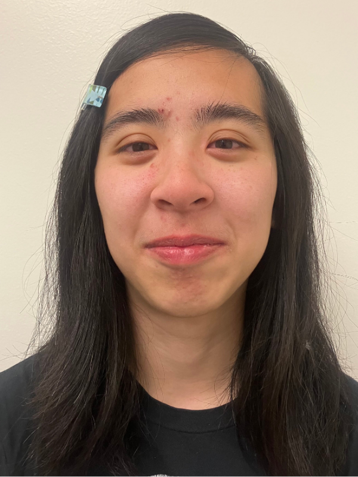 | 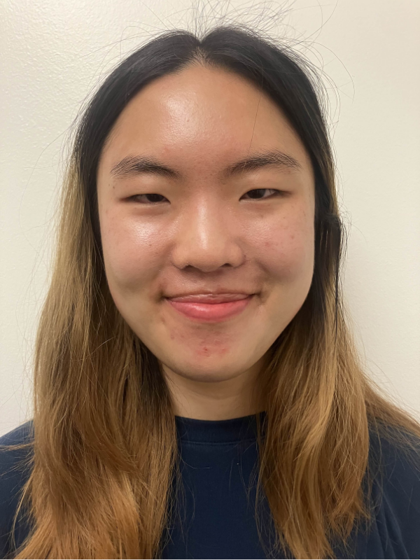 |
| 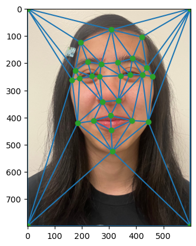 | 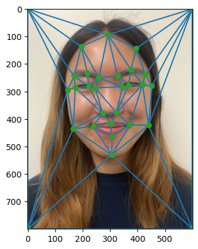 |

## Part 2: Computing the "Mid-Way" Face

Next, I used [inverse warping](https://en.wikipedia.org/wiki/Image_warping) to compute the "mid-way" face structure and colors between myself and Elana.

Specifically, for each triangle in the triangulation:

1. Compute an affine transformation matrix from the source image (either me or Elana) to the average shape
2. Compute the inverse transformation matrix
3. For each triangle in the average triangulation:
    1. Get all of the points within the triangle (using [`skimage.draw.polygon`](https://scikit-image.org/docs/dev/api/skimage.draw.html#skimage.draw.polygon))
    2. Multiply the inverse transformation matrix by all the points in the previous step to get the corresponding points in the source image
    3. Perform nearest neighbor interpolation using [`scipy.interpolate.griddata`](https://docs.scipy.org/doc/scipy/reference/generated/scipy.interpolate.griddata.html) using the source image colors to determine the colors for each of the corresponding points within the average triangle
4. Repeat everything for the second source image

The structure of an affine transformation matrix is like so:

$$
\begin{pmatrix}
a & b & c \\
d & e & f \\
0 & 0 & 1
\end{pmatrix}
\begin{pmatrix}
s_{x_i} \\
s_{y_i} \\
1
\end{pmatrix}
=
\begin{pmatrix}
d_{x_i} \\
d_{y_i} \\
1
\end{pmatrix}
$$

where $$s_{x_i}, s_{y_i}$$ is the source $$(x, y)$$ pair and $$d_{x_i}, d_{y_i}$$ is the destination $$(x, y)$$ pair. If we are trying to warp a triangle's vertices, $$i$$ is between 1 and 3 (inclusive) since we have 3 coordinate pairs. (However this can be extended to any number of points we want to warp in the same way.)

To find $$a, b, c, d, e, f$$, I used [`numpy.linalg.solve`](https://numpy.org/doc/2.0/reference/generated/numpy.linalg.solve.html) to solve this system of linear equations since we know $$s_x, s_y, d_x, d_y$$ for all $$i$$:

$$\begin{pmatrix}
s_{x_1} & s_{y_1} & 1 & 0 & 0 & 0 \\
0 & 0 & 0 & s_{x_1} & s_{y_1} & 1 \\
s_{x_2} & s_{y_2} & 1 & 0 & 0 & 0 \\
0 & 0 & 0 & s_{x_2} & s_{y_2} & 1 \\
s_{x_3} & s_{y_3} & 1 & 0 & 0 & 0 \\
0 & 0 & 0 & s_{x_3} & s_{y_3} & 1
\end{pmatrix}
\begin{pmatrix}
a \\
b \\
c \\
d \\
e \\
f
\end{pmatrix}
=
\begin{pmatrix}
d_{x_1} \\
d_{y_1} \\
d_{x_2} \\
d_{y_2} \\
d_{x_3} \\
d_{y_3}
\end{pmatrix}
$$

One challenge I faced while implementing this was realizing that "coordinates" for 2D numpy arrays are actually flipped. When indexing into a numpy array, doing `arr[a, b]` means getting row `a` and column `b`, which means in a typical $$(x, y)$$ coordinate system, the coordinate would be represented as $$(b, a)$$ rather than $$(a, b)$$.

| Rebecca Warped to Average Shape | Midway Face (Color is the average of the 2 warped images) | Elana Warped to Average Shape |
| --- | --- | --- |
| 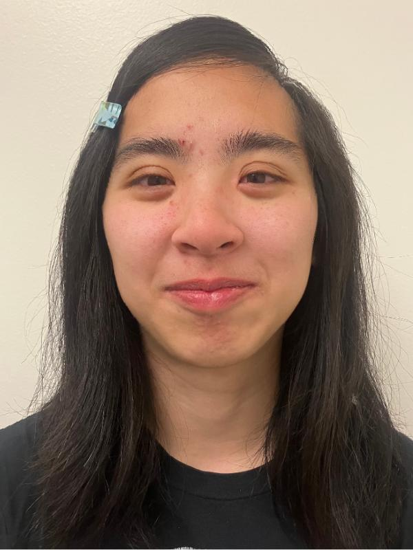 | 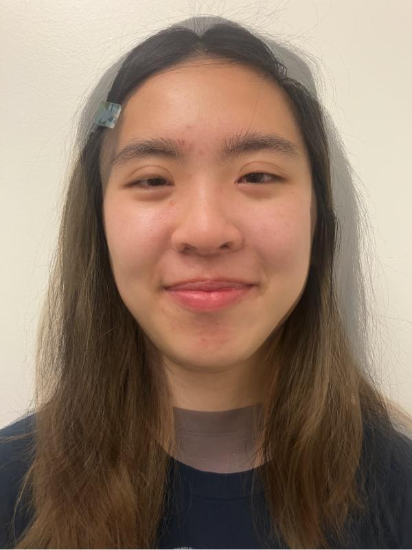 | 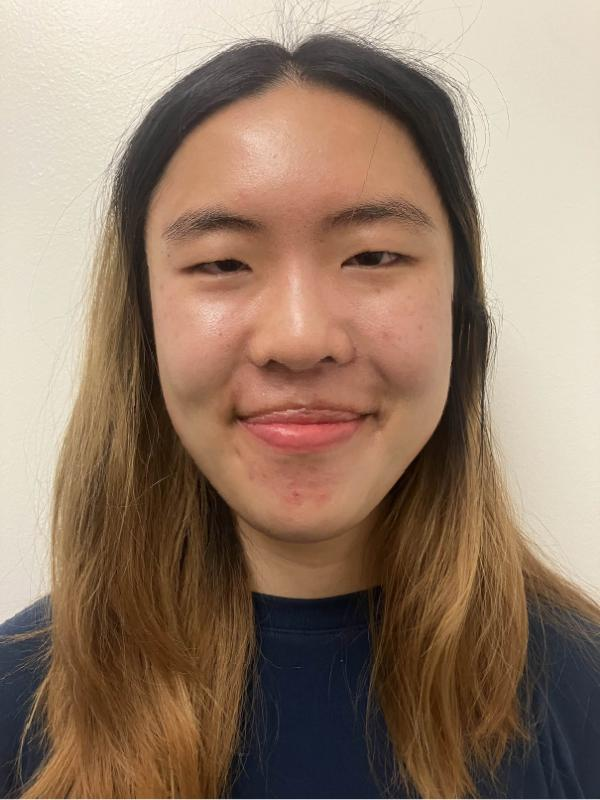 |

## Part 3: The Morph Sequence

Next I applied the same operation I did in Part 2, except now I also compute intermediate faces (not just the exact middle face) and cross-dissolve 45 frames. This is accomplished by adjusting a `warp_frac` (controls facial structure) and `dissolve_frac` (controls colors) that determines how much of the source face versus how much of the destination face is used.

    

## Part 4: The "Mean Face" of a Population

Next, I used this [dataset of 40 Danish faces and correspondence points](https://web.archive.org/web/20070613160541/https://www2.imm.dtu.dk/~aam/datasets/imm_face_db.zip) to compute the average neutral Dane face. To do this, I read in each of the images, correspondence files, and warped each face into the average shape (correspondence points). Here are some examples of Danes 5, 7, 12, and 19 warped to the average geometry:

| 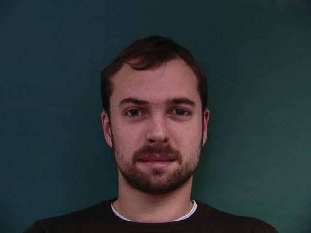 | 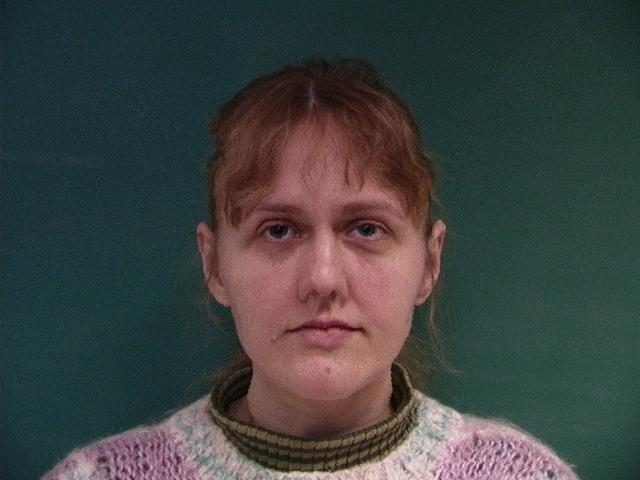 |
|  |  |

One challenge I faced while reading in the correspondence points was the slightly incorrect documentation of the file format. While the documentation said that the first coordinate was a relative x value and the second coordinate was a relative y value, it was in fact flipped. The first coordinate was a relative row coordinate and the second coordinate was a relative column coordinate, so I didn't have to do any additional processing to work with the coordinates in numpy arrays like in Part 2.

Then, I stacked the warped faces together and took the average of the colors to get the average neutral Dane face. I also cropped and rescaled the average Dane face so that I could warp myself to the average Dane geometry, and vice versa. You can observe some funny warping behavior because of how my face is not exactly aligned to the face of the average Dane in the dataset (in my picture, my face is vertically higher than the average Dane face).

| Average neutral Dane face | Rebecca warped to average Dane geometry | Average Dane warped to Rebecca geometry |
| --- | --- | --- |
| 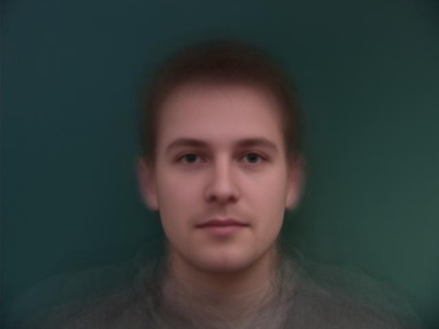 | 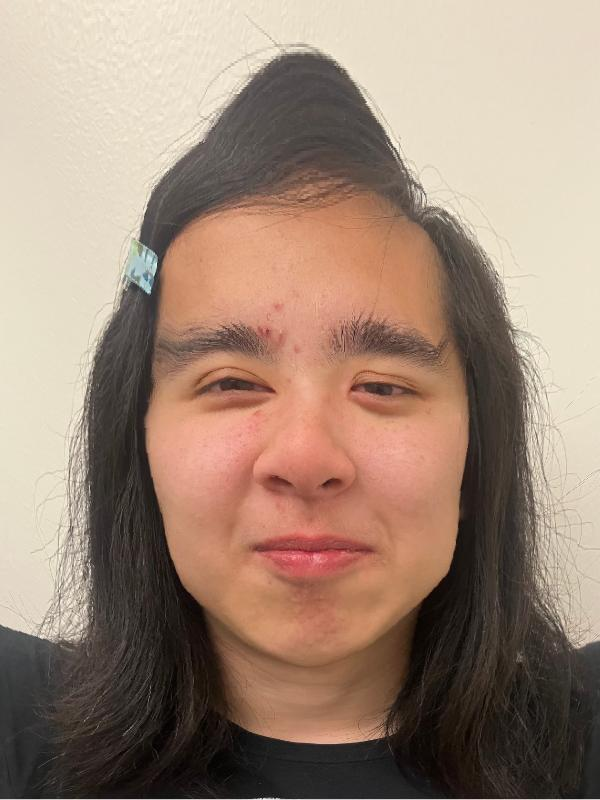 | 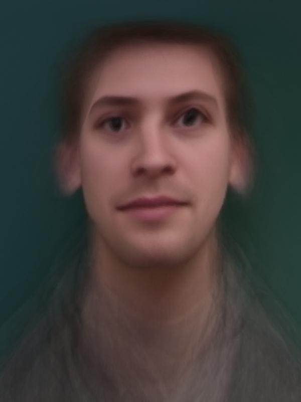 |

## Part 5: Caricatures: Extrapolating From the Mean

## Bells and Whistles

### Morphing music video on a theme

To celebrate the upcoming release of [Arcane](https://en.wikipedia.org/wiki/Arcane_(TV_series)) season 2, I decided to create a morphing music video of the season 2 character posters in the order in which the posters were released: [Ekko](https://x.com/arcaneshow/status/1825910698918162676), [Caitlyn](https://x.com/arcaneshow/status/1828447401470001230), [Jinx](https://x.com/arcaneshow/status/1830955255808352632), and finally [Vi](https://x.com/arcaneshow/status/1832411007807017059). The background music is the instrumental version of the TV show's title song, [Enemy by Imagine Dragons feat. JID](https://www.youtube.com/watch?v=-yN2r5h5TwM&ab_channel=IUploadStems).

<iframe width="560" height="315" src="https://www.youtube-nocookie.com/embed/WDh9NF7ZHIg?si=YvXEeQxqUUjQ6ll3" title="YouTube video player" frameborder="0" allow="accelerometer; autoplay; clipboard-write; encrypted-media; gyroscope; picture-in-picture; web-share" referrerpolicy="strict-origin-when-cross-origin" allowfullscreen></iframe>

Here is a [link](https://youtu.be/WDh9NF7ZHIg) to the video if the embed above doesn't work. I also cross-posted to the [r/arcane subreddit](https://www.reddit.com/r/arcane/comments/1fz55kj/s2_spoilers_character_posters_morphed_together/)!
