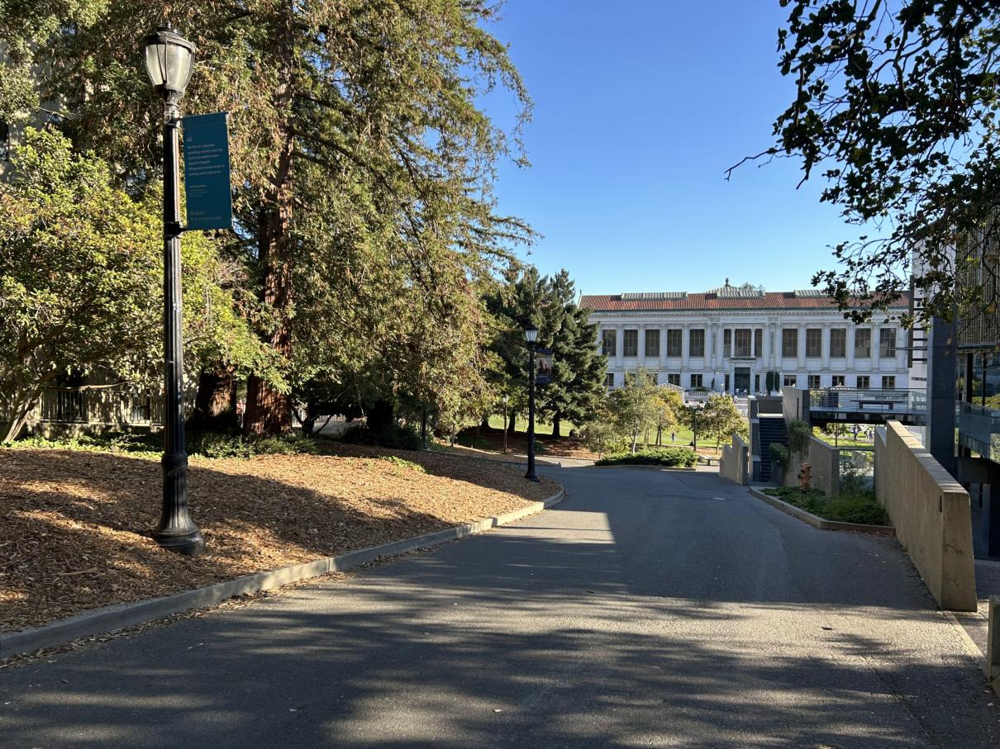

<!-- Mathjax Support -->

# Project 4

\[Auto\]Stitching Photo Mosaics - [Project Spec](https://inst.eecs.berkeley.edu/~cs180/fa24/hw/proj4/index.html)

1. Table of Contents
{:toc}

## Project 4A

Image Warping and Mosaicing - [Project Spec](https://inst.eecs.berkeley.edu/~cs180/fa24/hw/proj4/partA.html)

### Shoot the Pictures

To do this project, I needed to take pictures to perform image rectification and mosaicing.

For the image rectification, I chose to take a picture of a [Computer Science Mentors](https://csmentors.studentorg.berkeley.edu/) CS 88 worksheet and a piece of art in Soda Hall 380 (both taken at an angle so they can later be rectified). I then [rescaled](https://scikit-image.org/docs/stable/api/skimage.transform.html#skimage.transform.rescale) the images by a factor of `0.3` to make processing the images faster in later parts (fewer pixels to operate on).

| Worksheet | Art |
| :--- | :--- |
|  |  |

For image mosaicing, I needed to take 3 sets of photos of the same scenery and the same center of projection (e.g. only the camera lens rotates, but the axis of rotation is the same). I chose to take pictures of a hike on the [Berkeley Fire Trails](https://maps.app.goo.gl/qPmW1P4tjoZkJzYS8), a [path on campus](https://maps.app.goo.gl/k5gq2NBvM3SLgfNg7) between Valley Life Sciences Building and Haviland Hall, and a view of Doe Library and the Memorial Glade going down [the North Gate path](https://maps.app.goo.gl/rxjzH346awgBhQjA7).

| Location | Left Image | Right Image |
| :--- | :--- | :--- |
| Fire Trails |  |  |
| Campus Path |  |  |
| Doe Library |  |  |

### Recover Homographies

A [homography](https://en.wikipedia.org/wiki/Homography) is a mapping between any 2 projective planes with the same center of projection. (See [lecture slides from Fall 2024](https://inst.eecs.berkeley.edu/~cs180/fa24/Lectures/mosaic.pdf#page=36).) We can use homographies to warp images and perform rectification and mosaicing.

To compute a homography from a source point $$(s_{x_i}, s_{y_i}, 1)$$ to a destination point $$(wd_{x_i}, wd_{y_i}, w)$$, you need to compute the values in the $$3 \times 3$$ homography matrix $$H$$ below. Also note that the source and destination points are [homogeneous coordinates](https://en.wikipedia.org/wiki/Homogeneous_coordinates).

$$
\begin{bmatrix}
a & b & c \\
d & e & f \\
g & h & 1
\end{bmatrix}
\begin{bmatrix}
s_{x_i} \\
s_{y_i} \\
1
\end{bmatrix}
=
\begin{bmatrix}
wd_{x_i} \\
wd_{y_i} \\
w
\end{bmatrix}
$$

Assuming you know $$H$$, you can apply it to every point $$i$$ in the source image.

To find $$a$$ through $$h$$, you need to solve this system of linear equations since we know $$s_x, s_y, d_x, d_y$$ for a subset of $$i$$, the correspondence points, which are manually marked using the [correspondence tool from Project 3](https://cal-cs180.github.io/fa23/hw/proj3/tool.html).

$$\begin{bmatrix}
s_{x_1} & s_{y_1} & 1 & 0 & 0 & 0 & -s_{x_1} * d_{x_1} & -s_{y_1} * d_{x_1} \\
0 & 0 & 0 & s_{x_1} & s_{y_1} & 1 & -s_{x_1} * d_{y_1} & -s_{y_1} * d_{y_1} \\
\dots & \dots & \dots & \dots & \dots & \dots & \dots & \dots \\
s_{x_n} & s_{y_n} & 1 & 0 & 0 & 0 & -s_{x_n} * d_{x_n} & -s_{y_n} * d_{x_n} \\
0 & 0 & 0 & s_{x_n} & s_{y_n} & 1 & -s_{x_n} * d_{y_n} & -s_{y_n} * d_{y_n}
\end{bmatrix}
\begin{bmatrix}
a \\
b \\
c \\
d \\
e \\
f \\
g \\
h
\end{bmatrix}
=
\begin{bmatrix}
d_{x_1} \\
d_{y_1} \\
\dots \\
d_{x_n} \\
d_{y_n}
\end{bmatrix}
$$

Note: $$n$$ is the total number of homogeneous coordinate pairs in the source/destination image.

As you can see, the system is overdetermined if $$n > 4$$. Because of this, we must use [least squares](https://numpy.org/doc/stable/reference/generated/numpy.linalg.lstsq.html) to find a "best fit" solution.

### Warp the Images

Now that we have a way to compute $$H$$, we can perform warping by writing a function `warp_image(img, H)`. Here is an overview of the warping algorithm:

1. Compute $$H^{-1}$$
2. Determine the size of the warped image
    1. Get the $$(x, y, 1)$$ coordinates of the corners of the source image
    2. Warp the source corners to get the destination corners by doing `H @ src_corners`, where `src_corners` is a $$3 \times 4$$ matrix (each column is a homogeneous coordinate representing a corner)
    3. Normalize the destination corners (e.g. divide $$(wx, wy)$$ by $$w$$)
    4. Get the min and max $$x$$ and $$y$$ coordinates to figure out the size of the warped image
3. Determine all of the $$(x, y, 1)$$ coordinates inside the warped image. Call this $$3 \times n$$ matrix `dest_pts` (each column is a homogeneous coordinate).
4. Perform an inverse warp (like in [Project 3](../proj3/index.md))
    1. Do `H_inverse @ dest_pts`
    2. Normalize the matrix product like in step 2.3
    3. Use [`scipy.ndimage.map_coordinates`](https://docs.scipy.org/doc/scipy/reference/generated/scipy.ndimage.map_coordinates.html#scipy.ndimage.map_coordinates) to interpolate color values

### Image Rectification

To rectify the worksheet and art images, I marked their corners and then hardcoded their corresponding points based on the assumption that the worksheet is 8.5 x 11 inches and that the art has a 2:3 ratio (width:height):

| Source Points | Destination Points |
| :--- | :--- |
|  |  |
|  |  |

I then computed $$H_{\text{worksheet}}$$ and $$H_{\text{art}}$$, and performed the warping algorithm described in the previous section to rectify the images. I also cropped the resulting warped image to remove unnecessary black pixels created by performing the projective transformation.

| Worksheet Rectified | Art Rectified |
| :--- | :--- |
|  |  |

Note that the rectified worksheet top is not perfectly straight despite the hardcoded rectangular destination points. This is because in the source image, the paper is not completely flat on the table due to the dog-eared corners.

### Blend the images into a mosaic

TODO

## Project 4B

In progress!
