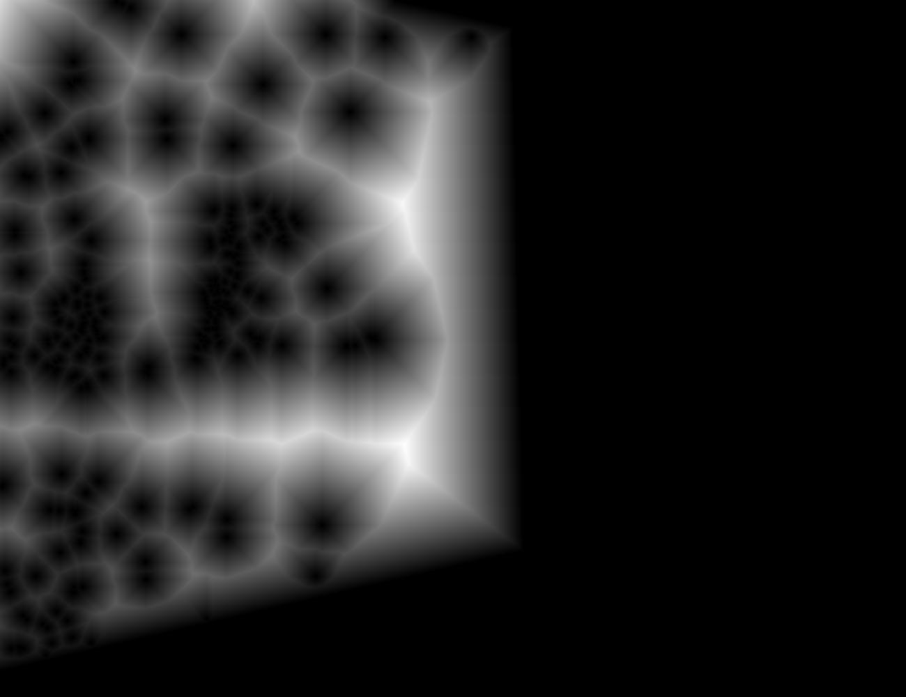
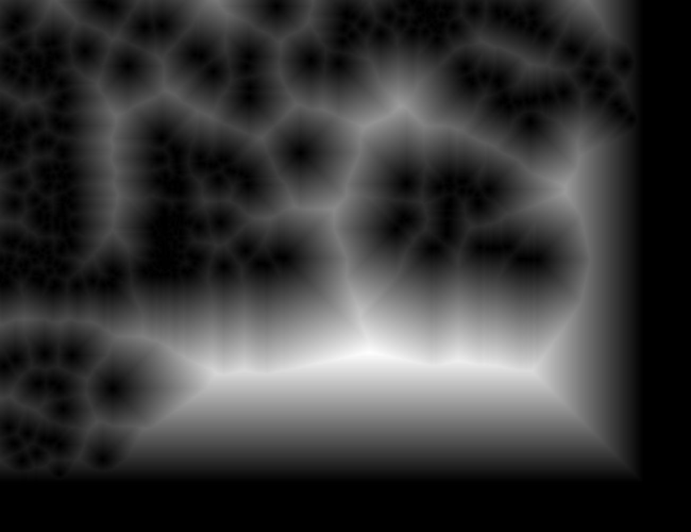
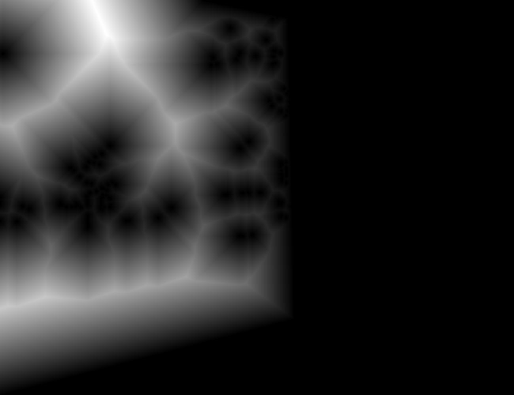
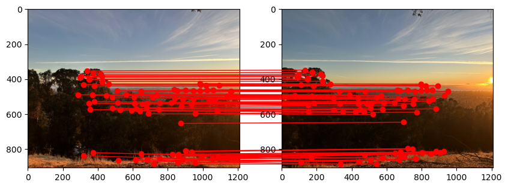

<!-- Mathjax Support -->

# Project 4

\[Auto\]Stitching Photo Mosaics - [Project Spec](https://inst.eecs.berkeley.edu/~cs180/fa24/hw/proj4/index.html)

1. Table of Contents
{:toc}

## Project 4A

Image Warping and Mosaicing - [Project Spec](https://inst.eecs.berkeley.edu/~cs180/fa24/hw/proj4/partA.html)

### Shoot the Pictures

To do this project, I needed to take pictures to perform image rectification and mosaicing.

For the image rectification, I chose to take a picture of a [Computer Science Mentors](https://csmentors.studentorg.berkeley.edu/) CS 88 worksheet and a piece of art in Soda Hall 380 (both taken at an angle so they can later be rectified). I then [rescaled](https://scikit-image.org/docs/stable/api/skimage.transform.html#skimage.transform.rescale) the images by a factor of `0.3` to make processing the images faster in later parts (fewer pixels to operate on).

| Worksheet | Art |
| :--- | :--- |
|  |  |

For image mosaicing, I needed to take 3 sets of photos of the same scenery and the same center of projection (e.g. only the camera lens rotates, but the axis of rotation is the same). I chose to take pictures of a hike on the [Berkeley Fire Trails](https://maps.app.goo.gl/qPmW1P4tjoZkJzYS8), a [path on campus](https://maps.app.goo.gl/k5gq2NBvM3SLgfNg7) between Valley Life Sciences Building and Haviland Hall, and a view of Doe Library and the Memorial Glade going down [the North Gate path](https://maps.app.goo.gl/rxjzH346awgBhQjA7). I also rescaled these images by a factor of `0.3`.

| Location | Left Image | Right Image |
| :--- | :--- | :--- |
| Fire Trails |  |  |
| Campus Path |  |  |
| Doe Library |  |  |

### Recover Homographies

A [homography](https://en.wikipedia.org/wiki/Homography) is a mapping between any 2 projective planes with the same center of projection. (See [lecture slides from Fall 2024](https://inst.eecs.berkeley.edu/~cs180/fa24/Lectures/mosaic.pdf#page=36).) We can use homographies to warp images and perform rectification and mosaicing.

To compute a homography from a source point $$(s_{x_i}, s_{y_i}, 1)$$ to a destination point $$(wd_{x_i}, wd_{y_i}, w)$$, you need to compute the values in the $$3 \times 3$$ homography matrix $$H$$ below. Also note that the source and destination points are [homogeneous coordinates](https://en.wikipedia.org/wiki/Homogeneous_coordinates).

$$
\begin{bmatrix}
a & b & c \\
d & e & f \\
g & h & 1
\end{bmatrix}
\begin{bmatrix}
s_{x_i} \\
s_{y_i} \\
1
\end{bmatrix}
=
\begin{bmatrix}
wd_{x_i} \\
wd_{y_i} \\
w
\end{bmatrix}
$$

Assuming you know $$H$$, you can apply it to every point $$i$$ in the source image.

To find $$a$$ through $$h$$, you need to solve this system of linear equations since we know $$s_x, s_y, d_x, d_y$$ for a subset of $$i$$, the correspondence points, which are manually marked using the [correspondence tool from Project 3](https://cal-cs180.github.io/fa23/hw/proj3/tool.html).

$$\begin{bmatrix}
s_{x_1} & s_{y_1} & 1 & 0 & 0 & 0 & -s_{x_1} * d_{x_1} & -s_{y_1} * d_{x_1} \\
0 & 0 & 0 & s_{x_1} & s_{y_1} & 1 & -s_{x_1} * d_{y_1} & -s_{y_1} * d_{y_1} \\
\dots & \dots & \dots & \dots & \dots & \dots & \dots & \dots \\
s_{x_n} & s_{y_n} & 1 & 0 & 0 & 0 & -s_{x_n} * d_{x_n} & -s_{y_n} * d_{x_n} \\
0 & 0 & 0 & s_{x_n} & s_{y_n} & 1 & -s_{x_n} * d_{y_n} & -s_{y_n} * d_{y_n}
\end{bmatrix}
\begin{bmatrix}
a \\
b \\
c \\
d \\
e \\
f \\
g \\
h
\end{bmatrix}
=
\begin{bmatrix}
d_{x_1} \\
d_{y_1} \\
\dots \\
d_{x_n} \\
d_{y_n}
\end{bmatrix}
$$

Note: $$n$$ is the total number of homogeneous coordinate pairs in the source/destination image.

As you can see, the system is overdetermined if $$n > 4$$. Because of this, we must use [least squares](https://numpy.org/doc/stable/reference/generated/numpy.linalg.lstsq.html) to find a "best fit" solution.

### Warp the Images

Now that we have a way to compute $$H$$, we can perform warping by writing a function `warp_image(img, H)`. Here is an overview of the warping algorithm:

1. Compute $$H^{-1}$$
2. Determine the size of the warped image
    1. Get the $$(x, y, 1)$$ coordinates of the corners of the source image
    2. Warp the source corners to get the destination corners by doing `H @ src_corners`, where `src_corners` is a $$3 \times 4$$ matrix (each column is a homogeneous coordinate representing a corner)
    3. Normalize the destination corners (e.g. divide $$(wx, wy)$$ by $$w$$)
    4. Get the min and max $$x$$ and $$y$$ coordinates to figure out the size of the warped image
3. Determine all of the $$(x, y, 1)$$ coordinates inside the warped image. Call this $$3 \times n$$ matrix `dest_pts` (each column is a homogeneous coordinate).
4. Perform an inverse warp (like in [Project 3](../proj3/index.md))
    1. Do `H_inverse @ dest_pts`
    2. Normalize the matrix product like in step 2.3
    3. Use [`scipy.ndimage.map_coordinates`](https://docs.scipy.org/doc/scipy/reference/generated/scipy.ndimage.map_coordinates.html#scipy.ndimage.map_coordinates) to interpolate color values

### Image Rectification

To rectify the worksheet and art images, I marked their corners and then hardcoded their corresponding points based on the assumption that the worksheet is 8.5 x 11 inches and that the art has a 2:3 ratio (width:height):

| Source Points | Destination Points |
| :--- | :--- |
|  |  |
|  |  |

I then computed $$H_{\text{worksheet}}$$ and $$H_{\text{art}}$$, and performed the warping algorithm described in the previous section to rectify the images. I also cropped the resulting warped image to remove unnecessary black pixels created by performing the projective transformation.

| Worksheet Rectified | Art Rectified |
| :--- | :--- |
|  |  |

Note that the rectified worksheet top is not perfectly straight despite the hardcoded rectangular destination points. This is because in the source image, the paper is not completely flat on the table due to the dog-eared corners.

### Blend the images into a mosaic

To create an image mosaic (e.g. stitching together each pair of images of the Berkeley landscape), I can also do the same warping using homographies. Specifically, the approach is to:

1. Determine correspondence points manually using the correspondence tool linked above
2. Warp image 1 to image 2
3. Zero pad warped image 1 and original image 2 so that their dimensions match
4. Blend warped image 1 with original image 2

I experimented with various blending methods. First, I tried a naive blending by taking the average of the padded images. This led to noticeable edges between warped image 1 and image 2:

Next I tried doing blending using a Laplacian stack with a "half half" alpha mask like in [Project 2](../proj2/index.md), where all the pixels on the left of the mask are 1 and all the pixels on the right of the mask are 0:

This was a significant improvement from the naive blending method, but there is a noticeable artifact at the top. You can also see a faint vertical line at the midpoint of the mosaic:

The best result was achieved with a mask using the [distance transform](https://en.wikipedia.org/wiki/Distance_transform) of each image using [cv2.distanceTransform](https://docs.opencv.org/3.4/d2/dbd/tutorial_distance_transform.html), and then finding locations where left distance transform is greater than the right distance transform (I called this `where_greater`). The final mask is made by `np.dstack`-ing `where_greater` for each of the 3 color channels (RGB). I also cropped the blended images to remove any unnecessary black pixels.

| Image | Left Image Distance Transform | Right Image Distance Transform | Distance Transform 1 > Distance Transform 2 |
| :--- | :--- | :--- | :--- |
| Fire Trails |  |  |  |
| Campus Path |  |  |  |
| Doe Library |  |  |  |

Here are the final blended results:

| Fire Trails | Campus Path | Doe Library |
| :--- | :--- | :--- |
|  |  |  |

<!-- TODO: This entire mosaicing process can be further generalized to make a mosaic of multiple images from the same scenery to form a panorama. Instead of warping one image to another, we can warp all images to a center image. This will be left for the next part of the project! -->

## Project 4B

Feature Matching and Autostitching - [Project Spec](https://inst.eecs.berkeley.edu/~cs180/fa24/hw/proj4/partB.html)

In the second part of the project, let's try to automatically stitch images together instead of manually marking correspondence points. I did this my implementing a simplified version of [Multi-image matching using multi-scale oriented patches by M. Brown, R. Szeliski and S. Winder (2005)](https://inst.eecs.berkeley.edu/~cs180/fa24/hw/proj4/Papers/MOPS.pdf). See [References](#references) for the direct IEEE paper link (instead of the CS 180 course website link). The overall steps to perform autostitching is:

1. Feature selection (e.g. choose points of interest in the source and destination images)
2. Creating descriptors for each feature
3. Matching feature descriptors
4. Feeding the matched feature points into the same mosaic creation algorithm as in [Part A](#project-4a)

### Feature Selection: Harris corners and ANMS

To detect a distinct feature in an image, I used a **[Harris corner detector](https://en.wikipedia.org/wiki/Harris_corner_detector)**. The idea behind this detector is that a corner can be identified if there is a large change in intensity when that patch in the image shifts a small amount in any direction.

Below is a picture of all the Harris corners on my left fire trails image. Notice that there are so many that it basically covers the entire image! To narrow down the number of corners/features, I filtered the points such that only the ones with a Harris corner score of over a threshold of 0.1 were retained.

| All Harris corners | Filtered Harris corners |
| :--- | :--- |
|  |  |

To ensure that the feature points are well-distributed across the image, I performed **Adaptive Non-Maximal Suppression (ANMS)**
to get the top $$N = 250$$ feature points (by Harris corner score) using the following algorithm:

1. Compute pairwise distances between each Harris corner coordinate. Note: I used numpy array broadcasting with [`np.newaxis`](https://numpy.org/doc/stable/reference/constants.html#numpy.newaxis) to vectorize computations (avoiding for loops which take longer). This created a 2D matrix where each entry at index `i, j` represents the distance between point `i` and point `j`.
2. For each Harris corner coordinate $$i$$ and each other Harris corner coordinate $$j$$, determine if its score $$s$$ meets the condition $$s_i < c_{\text{robust}} * s_j$$. In other words, we only keep points $$i$$ where its score is significantly smaller than point $$j$$'s score.
    1. Create a boolean mask and use that to only keep the pairwise distances that satisfy the inequality.
    2. For all scores that didn't satisfy the inequality, set their value to `np.inf` to ignore them in the next step.
3. Compute the minimum suppression radius for each point using the masked pairwise distances.
4. Sort the indices of each point in descending order of suppression radius (greatest to least) using [`np.argsort`](https://numpy.org/doc/stable/reference/generated/numpy.argsort.html).
5. Take the first $$N$$ coordinates using the sorted indices.

Below is my ANMS result when running the algorithm on the filtered Harris corners where $$c_{\text{robust}} = 0.9$$.

### Feature Descriptors: MOPS

Now that we have selected our feature points, we need a way to describe a small region, or patch, around each point. This is where feature descriptors come in. For this project, I implemented **Multi-Scale Oriented Patches (MOPS)**. For each $$40 \times 40$$ window in the original image centered on a feature point, I downsampled by a factor of 5 with [`skimage.transform.rescale`](https://scikit-image.org/docs/stable/api/skimage.transform.html#skimage.transform.rescale) (with `anti_aliasing=True` to perform Gaussian blur to prevent aliasing) to obtain a patch of size $$8 \times 8$$.

Then I performed bias-gain normalization (e.g. for each pixel value I subtracted the mean pixel value and divided by the standard deviation of pixel values in that patch) and flattened the normalized pixels. I repeated this process for each of the 3 color channels and concatenated the flattened pixels to form an $$(8 \times 8) \times 3 = 192$$ element vector describing each feature.

Since normalization affects the image coloration, below I present 3 example patches that were not normalized.

| Patch 0 | Patch 1 | Patch 2 |
| :--- | :--- | :--- |
|  |  |  |

### Matching Feature Descriptors: Nearest Neighbors and Lowe's Trick

Now that we have feature points and descriptors, we need a way to determine which points in the source image correspond to which points in the destination image. I used the following algorithm to match descriptors:

1. Compute the sum squared difference (our distance metric) between each feature descriptor pair. Note: I once again used `np.newaxis` to vectorize this operation. This created a 2D matrix where each entry at index `i, j` represents the distance between descriptor `i` (from the source image) and descriptor `j` (from the destination image).
2. Sort the distances in ascending order within each row to get the 1-NN and 2-NN (NN = nearest neighbor) distance values for each feature in the source image.
3. Use Lowe's trick to keep only the features where the 1-NN feature is a much better match than the 2-NN feature. That is, compute the Lowe score for each feature in the source image, which is `one_nn_dist / two_nn_dist`. Create a boolean mask of values where the Lowe score is less than some threshold. I chose 0.8.
4. Return an $$N \times  2$$ numpy array where $$N$$ is the number of matching descriptors. In the first column is the index of the feature in the source image, and in the second column is the matching feature index in the destination image.

Here is a mapping of feature descriptors for the left and right fire trails images:

### Robust Homography Computation: RANSAC

As you can see from the result above, even with all the filtering and nearest neighbors computations, there are still some incorrect correspondences. Since I used least squares (which is sensitive to outliers) to compute the homography matrix $$H$$, I needed to fix this with **RAndom SAmple Consensus (RANSAC)**. I implemented RANSAC as follows:

1. Initialize empty numpy arrays `best_src` and `best_dest`.
2. For a set number of iterations (I used 5000):
    1. Choose 4 pairs of (unique) points at random.
    2. Compute $$H$$ based on that sample of 4 paired points in the same way as before.
    3. Compute the transformation of all source points to destination points (making sure to normalize the homogeneous coordinates).
    4. Compute the Euclidean distance between each of the transformed points and the actual destination points.
    5. Create a boolean mask that includes distance values that are below some threshold. I chose 3.
    6. Let `num_inliers` be equal to the number of `True` values in this mask. If `num_inliers > len(best_src)`, then update `best_src` and `best_dest` to be those inlier points.
3. Return `best_src, best_dest`.

This was the result of performing RANSAC. You can observe that the outliers have been removed:

### Autostitched Mosaics

Using the methods described above to automatically find correspondence points, I was able to use the same warping and blending algorithms as in [Part A](#project-4a) to stitch together the pairs of left and right images from the Fire Trails, campus path, and Doe Library below:

| Fire Trails | Campus Path | Doe Library |
| :--- | :--- | :--- |
|  |  |  |

Notice that the mosaic quality is basically the same to the human eye in comparison to the mosaics formed with manually determined correspondence points.

### Coolest thing I learned from this project

I really enjoyed learning how to use homographies for image rectification. I was watching a [YouTube video of UC Berkeley Professor Hany Farid explaining techniques to detect deepfakes](https://www.youtube.com/watch?v=tVWRfFY9KPA&ab_channel=UCBerkeley), and it was super cool to see homographies being used in the wild to do the important work of combatting disinformation.

Additionally, the work I did to create image mosaics also gave me a newfound appreciation for the speed at which our smartphones are able to create panoramas. To stitch 2 images together, on average my code took about 2 minutes to run. However, our phone software is able to do something similar in a matter of seconds!

<!-- TODO bells and whistles writeup and resubmission -->

## References

- Previous Project 4 student websites (Fall 2023)
    - [Jeffrey Tan](https://inst.eecs.berkeley.edu/~cs180/fa23/upload/files/proj4B/tanjeffreyz02)
    - [Alec Li](https://inst.eecs.berkeley.edu/~cs180/fa23/upload/files/proj4B/alec.li/)
    - [Lance Mathias](https://inst.eecs.berkeley.edu/~cs180/fa23/upload/files/proj4B/lmathias/)
    - [Joshua You](https://inst.eecs.berkeley.edu/~cs180/fa23/upload/files/proj4B/jyou12/)
- M. Brown, R. Szeliski and S. Winder, "[Multi-image matching using multi-scale oriented patches](https://ieeexplore.ieee.org/abstract/document/1467310)," 2005 IEEE Computer Society Conference on Computer Vision and Pattern Recognition (CVPR'05), San Diego, CA, USA, 2005, pp. 510-517 vol. 1, doi: 10.1109/CVPR.2005.235.
- [StackOverflow: How do I use np.newaxis](https://stackoverflow.com/questions/29241056/how-do-i-use-np-newaxis)
- [StackOverflow: Drawing lines between two plots in matplotlib](https://stackoverflow.com/questions/17543359/drawing-lines-between-two-plots-in-matplotlib)
