<!-- Mathjax Support -->

# Project 5

1. Table of Contents
{:toc}

## Project 5A: The Power of Diffusion Models!

### Part 0: Setup

In the first part of the project, I played around with an already trained stable diffusion model, [DeepFloyd IF](https://huggingface.co/docs/diffusers/api/pipelines/deepfloyd_if).

To try out the diffusion model, I tried the following 3 prompts with the following `num_inference_steps` values. A higher number of steps resulted in higher quality output. I used a random seed of `180`.

20 steps:

| A man wearing a hat | A rocket ship | An oil painting of a snowy mountain village |
| :--- | :--- | :--- |
|  |  |  |

100 steps:

| A man wearing a hat | A rocket ship | An oil painting of a snowy mountain village |
| :--- | :--- | :--- |
|  |  |  |

### Part 1: Sampling Loops

#### 1.1 Implementing the Forward Process

First, I implemented a function `forward` which takes in an original image `im` and time step `t`. A higher `t` means more noise was added. Mathematically, this is represented as follows:

$$
x_t = \sqrt{\bar{\alpha_t}} x_0 + \sqrt{1 - \bar{\alpha_t}} \epsilon
$$

where:

- $$x_t$$ is the image at time step $$t$$ ($$x_0$$ is the original image)
- $$\bar{\alpha_t}$$ is a noise coefficient chosen by the people who trained DeepFloyd
- $$\epsilon \sim \mathcal{N}(0, 1)$$ is Gaussian noise

| Original | `t = 250` | `t = 500` | `t = 750` |
| :--- | :--- | :--- | :--- |
|  |  |  | 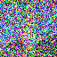 |

#### 1.2 Classical Denoising

Since stable diffusion is essentially trying to denoise an image step by step, first, I tried a classical denoising technique to attempt to recover the original image: [Gaussian blur](https://pytorch.org/vision/0.16/generated/torchvision.transforms.functional.gaussian_blur.html). As expected, the denoised output does not work very well. We get rid of the noise, but we also get rid of the "signal" (e.g. the actual original image).

| t | Noisy | Denoised |
| :--- | :--- | :--- |
| 250 |  | 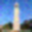 |
| 500 |  | 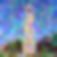 |
| 750 |  | 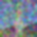 |

#### 1.3 One-Step Denoising

Next I used a pretrained diffusion model (a UNet trained on a large dataset of pairs of $$x_0$$ and $$x_t$$ images) to denoise the noisy images. The UNet uses estimates of the noise at a particular timestep to denoise the image. The output is noticeably better than using Gaussian blur, but at higher `t` values (such as `t = 750`) the denoised output tower starts to look quite different from the original Campanile tower.

For reference, here is the original image again:

| t | Noisy | Denoised |
| :--- | :--- | :--- |
| 250 |  |  |
| 500 |  |  |
| 750 |  |  |

#### 1.4 Iterative Denoising

To solve the issue mentioned in 1.3, we can use iterative denoising with a stride of 30 time steps, starting at `t = 990` to `t = 0`. I implemented the function `iterative_denoise` which uses the following formula:

$$
x_{t'} = \frac{\sqrt{\bar{\alpha_{t'}}} \beta_t}{1 - \bar{\alpha_t}} x_0 + \frac{\sqrt{\alpha_t} (1 - \bar{\alpha_{t'}})}{1 - \bar{\alpha_t}} x_t + v_{\sigma}
$$

where:

- $$x_t$$ is the same as in 1.1
- $$x_{t'}$$ is the noisy image at time step $$t'$$ where $$t' < t$$ (e.g. a slightly less noisy image)
- $$\bar{\alpha_t}$$ is the same as in 1.1
- $$\alpha_t$$ = $$\frac{\bar{\alpha_t}}{\bar{\alpha_{t'}}}$$
- $$\beta_t$$ = $$1 - \alpha_t$$
- $$x_0$$ is the same as in 1.1
- $$v_\sigma$$ is random noise

See also: [Denoising Diffusion Probabilistic Models](https://arxiv.org/pdf/2006.11239) by Jonathan Ho, Ajay Jain, and Pieter Abbeel.

The following shows the results of iterative denoising for every 5 loops:

| `t = 690` | `t = 540` | `t = 390` | `t = 240` | `t = 90` |
| :--- | :--- | :--- | :--- | :--- |
| 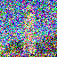 | 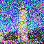 | 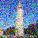 | 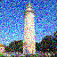 | 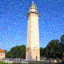 |

Here are the other outputs for reference:

| Original | Gaussian Blur Denoised | One-Step Denoised | Iterative Denoised |
| :--- | :--- | :--- | :--- |
|  | 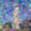 | 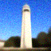 | 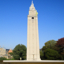 |

We can observe that the iteratively denoised image produces the best result.

#### 1.5 Diffusion Model Sampling

Stable diffusion works by converting noise to completely denoised images. Thus, I can use my `iterative_denoise` function from 1.4 to generate images from completely noisy images (e.g. an image with pixels from a [Gaussian distribution](https://pytorch.org/docs/stable/generated/torch.randn.html)). Here are 5 generated images:

| Sample 1 | Sample 2 | Sample 3 | Sample 4 | Sample 5 |
| :--- | :--- | :--- | :--- | :--- |
|  |  |  | 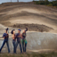 | 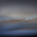 |

#### 1.6 Classifier-Free Guidance (CFG)

Some of the images in 1.5 are non-sensical, so to improve image output quality (at the expense of image diversity), I used a technique called [Classifier-Free Diffusion Guidance](https://arxiv.org/abs/2207.12598) developed by Jonathan Ho and Tim Salimans.

In CFG, we compute a conditional and unconditional noise estimate $$\epsilon_c$$ and $$\epsilon_u$$, respectively. Then we let our new noise estimate be:

$$
\epsilon = \epsilon_u + \gamma (\epsilon_c - \epsilon_u)
$$

where $$\gamma$$ controls the strength of the CFG. When $$\gamma \gt 1$$, we get higher quality images, such as the 5 random samples below:

| Sample 1 | Sample 2 | Sample 3 | Sample 4 | Sample 5 |
| :--- | :--- | :--- | :--- | :--- |
|  |  |  |  |  |

#### 1.7 Image-to-image Translation

Below are the results of taking 3 original images, adding varying levels of noise, and then iteratively denoising the noisy images with CFG. `i_start` denotes where we begin the iterative denoising process (e.g. lower value means we denoised with a few iterations and higher value means we denoised with a lot of iterations).

In addition to the given test image of the Campanile, I chose an image of the [Golden Gate Bridge](assets/a/1/7/0/golden-gate/golden-gate-bridge.jpg) and the [Eiffel Tower](assets/a/1/7/0/eiffel/eiffel.jpg) that were resized to $$64 \times 64$$.

| `i_start = 1` | `i_start = 3` | `i_start = 5` | `i_start = 7` | `i_start = 10` | `i_start = 20` | Original |
| :--- | :--- | :--- | :--- | :--- | :--- | :--- |
|  | 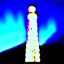 |  |  |  |  |  |
|  |  |  |  |  |  |  |
|  |  |  |  |  |  |  |

See also: [SDEdit algorithm](https://sde-image-editing.github.io/) by Meng et al. (2022).

##### 1.7.1 Editing Hand-Drawn and Web Images

In this subpart, I drew 2 images and found 1 image from the web and utilized the diffusion model to edit the images using the same method as above.

| `i_start = 1` | `i_start = 3` | `i_start = 5` | `i_start = 7` | `i_start = 10` | `i_start = 20` | Original |
| :--- | :--- | :--- | :--- | :--- | :--- | :--- |
|  |  |  |  |  |  |  |
|  |  |  |  |  |  | |
|  |  |  |  |  |  |  |

##### 1.7.2 Inpainting

Next I implemented the inpainting part of this [paper](https://arxiv.org/abs/2201.09865), RePaint: Inpainting using Denoising Diffusion Probabilistic Models by Andreas Lugmayr, Martin Danelljan, Andres Romero, Fisher Yu, Radu Timofte, and Luc Van Gool. (Using this [paper](http://graphics.cs.cmu.edu/projects/scene-completion/), Scene Completion Using Millions of Photographs by James Hays and Alexei Efros, for inspiration on how to "complete" the scene.)

Given an image, $$x_{orig}$$, and binary mask $$m$$, I created a new image with the same content as the original where $$m = 0$$, but new content where $$m = 1$$. To do this, we run the diffusion denoising loop and only keep the part where the mask is 1:

$$
x_t \leftarrow m x_t + (1 - m) \text{forward}(x_{orig}, t)
$$

| Campanile with new top | Cat with dog head | Oski with dog head |
| :--- | :--- | :--- |
| 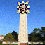 | 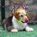 |  |

##### 1.7.3 Text-Conditional Image-to-image Translation

In this part, I changed the text prompt from `"a high quality image"` to `"a rocket ship"`, obtaining the results below with different levels of noise for the Campanile image and some images from the web.

| `i_start = 1` | `i_start = 3` | `i_start = 5` | `i_start = 7` | `i_start = 10` | `i_start = 20` | Original |
| :--- | :--- | :--- | :--- | :--- | :--- | :--- |
|  |  |  |  |  |  |  |
|  |  |  |  |  |  |  |
|  |  |  |  |  |  |  |

#### 1.8 Visual Anagrams

In this part, I implemented Visual Anagrams from [this paper](https://dangeng.github.io/visual_anagrams/), Visual Anagrams: Generating Multi-View Optical Illusions with Diffusion Models by Daniel Geng, Inbum Park, and Andrew Owens. To do this, we denoise like before but we alternate between 2 different text prompts and flip the image upside-down. That way, the final image right-side up looks like the first prompt, and upside-down looks like the second prompt.

The full algorithm is as follows:

$$
\epsilon_1 = \text{UNet}(x_t, t, p_1)
$$

$$
\epsilon_2 = \text{flip}(\text{UNet}(\text{flip}(x_t), t, p_2))
$$

$$
\epsilon = (\epsilon_1 + \epsilon_2) / 2
$$

where `flip` is a function that flips the image and `p_i` are the 2 text prompts. Our final noise estimate is $$\epsilon$$, which is the average of the 2 individual noise estimates.

<table>
    <tr>
        <th>Prompt 1</th>
        <th>Image</th>
        <th>Prompt 2</th>
        <th>Flipped Image</th>
    </tr>
    <tr>
        <td>an oil painting of an old man</td>
        <td></td>
        <td>an oil painting of people around a campfire</td>
        <td></td>
    </tr>
    <tr>
        <td>an oil painting of a snowy mountain village</td>
        <td></td>
        <td>a photo of the amalfi cost*</td>
        <td></td>
    </tr>
    <tr>
        <td>a lithograph of waterfalls</td>
        <td></td>
        <td>a lithograph of a skull</td>
        <td></td>
    </tr>
</table>

\*This should say "coast" but that's how the text embeddings were loaded in the starter code provided by staff :)

#### 1.9 Hybrid Images

In this part, I implemented this [paper](https://arxiv.org/abs/2404.11615), Factorized Diffusion: Perceptual Illusions by Noise Decomposition by Daniel Geng, Inbum Park, and Andrew Owens. Specifically, I used the diffusion model to create hybrid images like in [Project 2](/proj2/#part-22-hybrid-images).

Similar to the visual anagrams, we just have to adjust our noise estimate as follows:

$$
\epsilon_1 = \text{UNet}(x_t, t, p_1)
$$

$$
\epsilon_2 = \text{UNet}(x_t, t, p_2)
$$

$$
\epsilon = f_{\text{lowpass}}(\epsilon_1) + f_{\text{highpass}}(\epsilon_2)
$$

where $$f_{\text{lowpass}}$$ is a low pass filter and $$f_{\text{highpass}}$$ is a high pass filter. I used the suggested Gaussian blur of kernel size 33 and $$\sigma = 2$$.

| Prompt 1 | Prompt 2 | Hybrid Image |
| :--- | :--- | :--- |
| a lithograph of waterfalls | a lithograph of a skull |  |
| an oil painting of people around a campfire | a lithograph of a skull |  |
| a man wearing a hat | a lithograph of waterfalls |  |

## Project 5B: Diffusion Models from Scratch!

In construction

### Part 1: Training a Single-Step Denoising U-Net

In construction

### Part 2: Training a DDPM Denoising U-Net

In construction

### Part 3: Bells & Whistles

In construction
